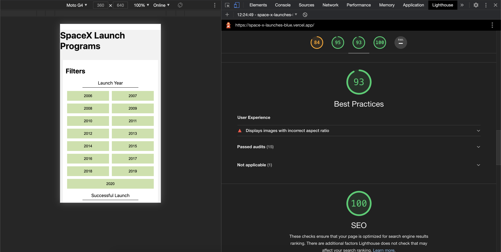

# :rocket: :rocket: :rocket: SpaceX Launches :rocket: :rocket: :rocket:

## Feature

1. Fully responsive (Mobile first).
2. User can filter program launches with available filter items on left pane.
3. URL will show currently added filter along with filter highlight.
4. Toggle on the select filter to remove filter.

## Inside Tech

1. Unit test cases for all created components (by React Testing library).
2. Inbuilt static analytic code check for production build.
3. Server side loaded pages.
4. Added coverage for entire application.

## Approach :thumbsup:

1. Created simple & stand alone reusable components.
2. Used Nextjs inbuilt useRouter & Router to get & add route parameteres from the url
3. Update url based on the route params.

## Challanged faced :open_mouth:

1. As the application heavily relies on images, special care should be taken to optimize performace of the page load.
2. Improve page perforamane and others based on light house report.

### Tech Stack used :book:

1. NextJS (React Framework)
2. HTML
3. CSS Modules
4. Vercel to deploy & github to host code

## Live Production URL :fire:

Open [demo] (https://space-x-launches-blue.vercel.app/) url to see live demo of application

## Lighthouse report :flashlight: :bulb

See attached 
